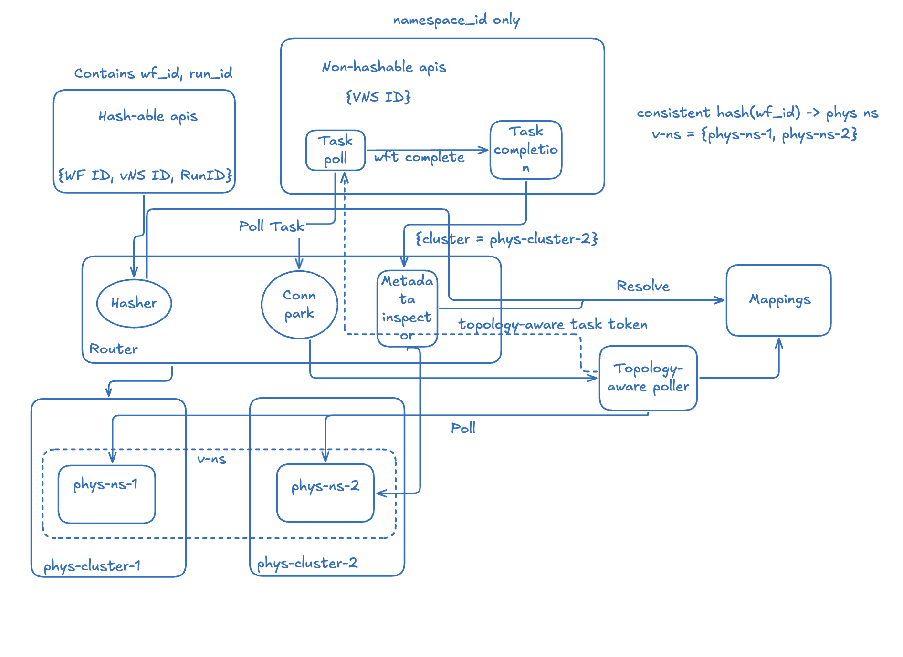
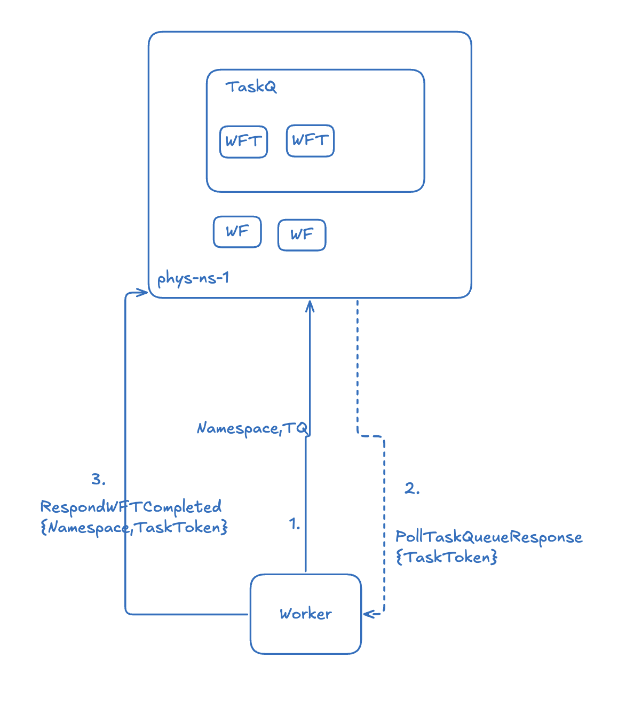

# Tempura

Tempura is a semantic aware load balancer for Temporal clusters with the goal to achieve active-active mode to unlock higher scaling capability.

# Why this project
Scaling a single Temporal cluster to handle extremely high throughput or deploying it in a true multi-region active-active fashion can be challenging due to its core architecture. Temporal doesn't natively support multi-cluster active-active deployments for a single logical namespace without modifying its core sharding architecture.

Tempura solves this by providing a routing layer:

- Semantic Routing & Sticky Proxy: It intercepts gRPC calls (e.g., StartWorkflowExecution, RespondWorkflowTaskCompleted) and inspects the protobuf payloads to extract semantic context like the WorkflowId and Namespace.
- Virtual Namespaces: It introduces the concept of a VirtualNamespace which maps to multiple physical namespaces distributed across different Temporal clusters.
- Connection Parking (ConnPark): For worker polling requests (PollWorkflowTaskQueue and PollActivityTaskQueue), Tempura fans out the poll to multiple backend clusters, routing the task back to the worker from whichever cluster has pending tasks.
- Workflow Stickiness: Once a workflow is assigned to a cluster, Tempura's resolver caches this mapping. All subsequent signals, updates, or task completions for that specific WorkflowId are strictly routed back to the exact physical cluster where the workflow execution lives.

By doing this, Tempura allows you to scale Temporal workloads horizontally across multiple independent backend clusters, achieving massive scalability and fault tolerance without requiring any configuration changes or sharding logic in the client applications.

# Limitations & workaround
- For apis that issue direct rpc into another history shard in the same cluster (apis that bypass Temporal frontend server), like signal another workflow from inside a workflow, cancelling external workflows from inside a workflow. You will need to wrap the code inside an activity in order to use Tempura. This is because these apis, if calling from inside a workflow, are handled by Temporal internal queues (timer/transfer), wrapping the call to an activity direct the request through Tempura's mapping layer.

# Usage
Start dependencies, assuming you are on mac
```bash
docker-compose -f sandbox/docker-compose.yml up -d
```
Run tempura
```bash
go build 
./tempura
```

Start a worker
```bash
go run scripts/worker.go
```

Start some workflows
```bash
go run scripts/start_workflows.go
```

# Architecture
Sticky proxy

Write-back task polling


# License
Apache 2.0